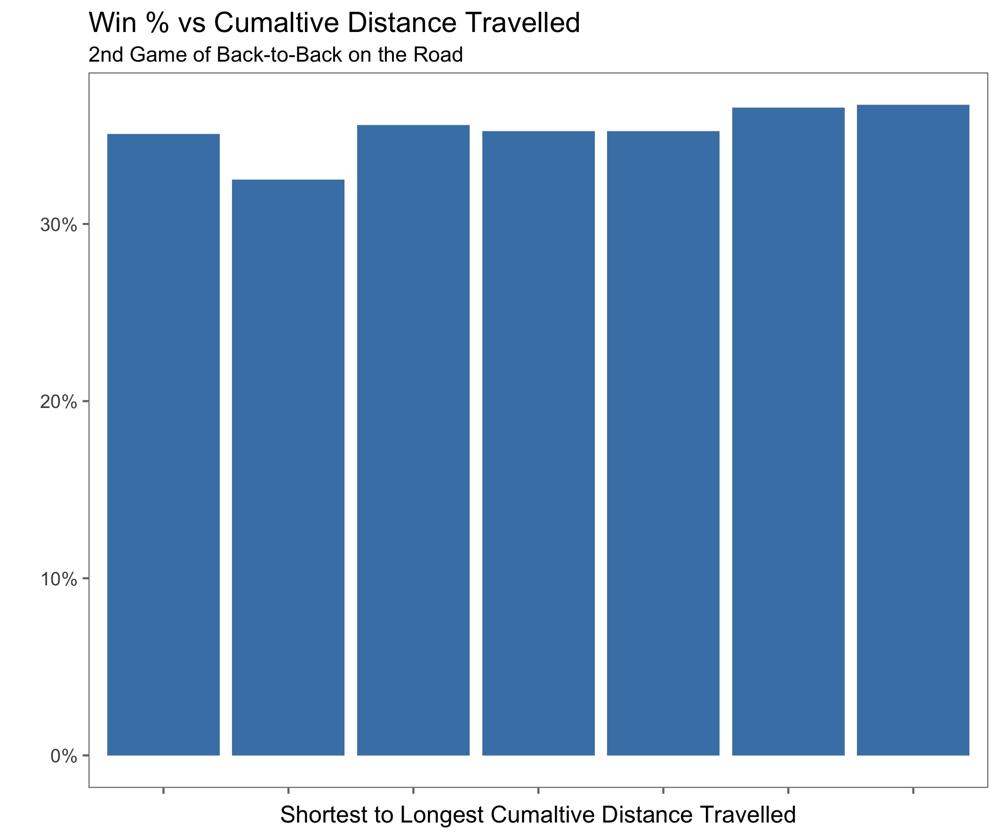
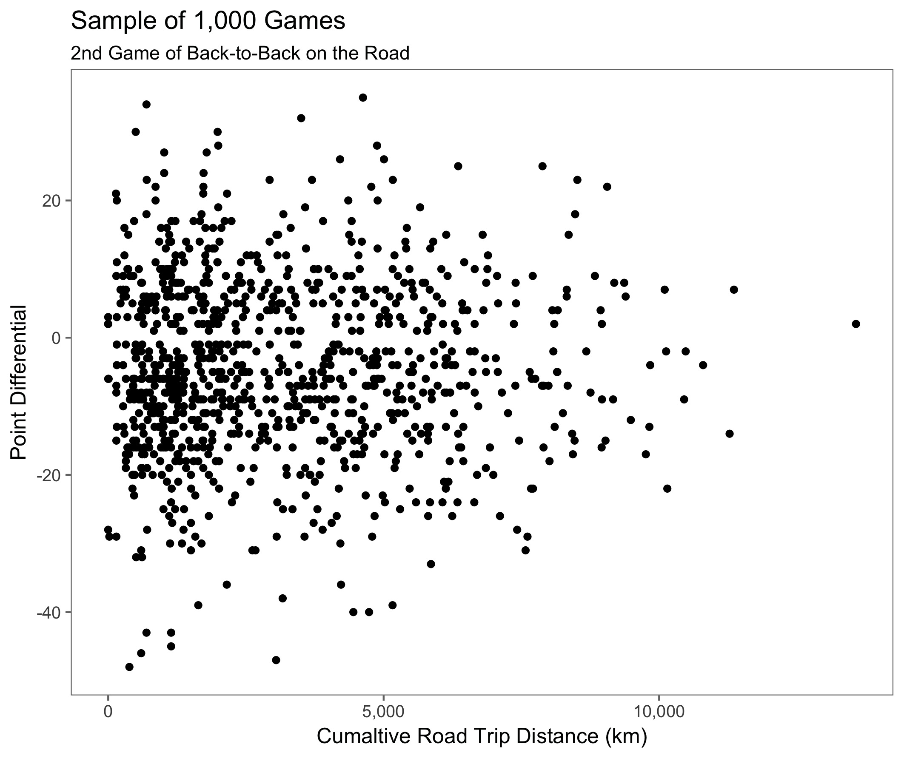
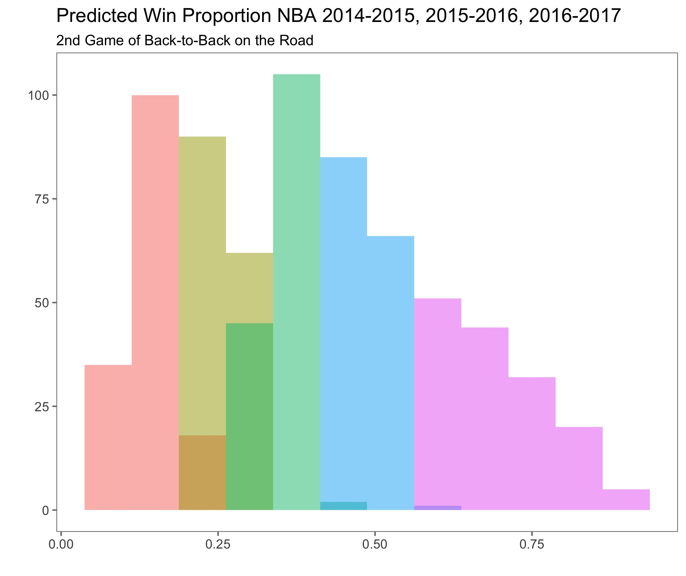
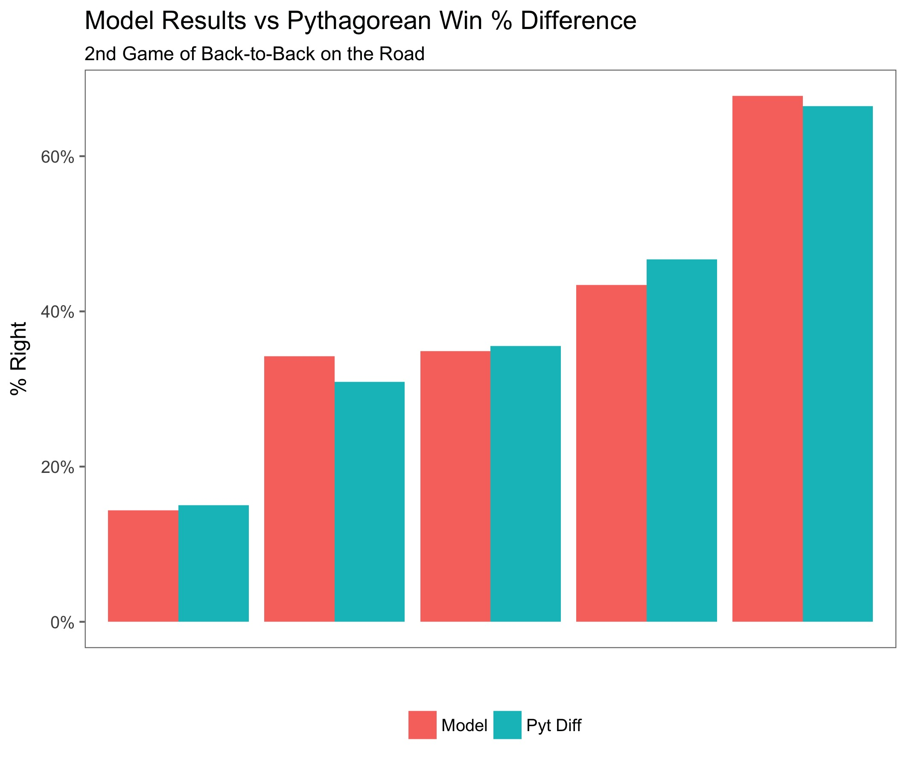

MSDA 609 Final Project
========================================================
author: Nicholas Capofari
date: May 12, 2017
autosize: true

Modeling NBA Results for Road Games Played on the 2nd Day of a Back-to-Back  
========================================================

<!--Mathjax Scripts-->

- Basketball is a demanding sport.  Each NBA team, on average, runs over a combined [16 miles per game](http://stats.nba.com/teams/speed-distance/).  
- Due to scheduling demands, teams are sometimes forced to play on back-to-back days.  For example, in the 2016-2017 season, teams played anywhere from [14 to 18 games](http://www.nbastuffer.com/tag/Schedule_Analysis.html) the day after playing a game the previous day.  
- My goal for this project is to determine if such a disadvantage exists and create a model that will predict the results of these games. 

Data Collection
========================================================

- All raw data was scraped from [basketball-reference.com](http://www.basketball-reference.com/) using the `rvest` package.
- Every NBA game result from 1979-1980 season (first season with the 3-point shot) to the 2016-2017 season.

Differences in Team Winning %s
========================================================

**Welch Two Sample t-test Comparing Home Win % to Road Win %**  

- p-value < 2.2e-16
- true difference in means is not equal to 0
- mean of x mean of y: 0.6139235, 0.3860746 

***

**Welch Two Sample t-test Comparing Road Win % to BB Road Win %**  

- p-value = 3.945e-07
- true difference in means is not equal to 0
- mean of x mean of y: 0.3993885, 0.3598452 

Model Restrictions
========================================================

- The last 3 seasons (2014-2015, 2015-2016, 2016-2017) will be used for testing.
- Game results will only be used from games played between game number 11 and game number 70 of both teams (reducing influence due to roster fluctuations) .
- Only include games played in November through March.

Categorical Variables to Explore
========================================================

- Day of the Week
- Month
- Year
- Back-to-Back Type (Away-Away, Home-Away)
- Result of Game Before (Win, Loss)
- Result of Game Before - Opponent (Win, Loss)
- Overtime Game Before
- Overtime Game Before - Opponent
- Is this a Back-to-Back for the Opponent

Continuous Variables to Explore
========================================================

- Games Played
- Length of Road Trip
- Days on the Road
- Games Left on Road Trip
- Distance Travel to Game
- Team Age
- Last 10 Games Win %
- Point Differential Game Before
- Road Pythagorean Win %
- Difference of Road Pyt Win % & Opponent Home Pyt Win %

Continuous Variables to Explore - Opponent
========================================================

Home Team (Opponent)

- Team Age
- Last 10 Games Win %
- Point Differential Game Before
- Home Pythagorean Win %
- Days Off Before Game
- Length of Home Stand
- Games Left of Home Stand

Variables of Interest
========================================================

After careful investigation (with the aid of statistical tests and visualizations) the following variables were kept to produce the model.

- Overtime Game Before
- Overtime Game Before - Opp
- Is this a Back-to-Back for the Opp
- Team Age
- Last 10 Games Win %
- Road Pyt Win % - Opponent Home Pyt Win %
- Team Age - Opp
- Last 10 Games Win % - Opp

Items of Note and Variable Omissions
========================================================

Real Team Age

- Instead of using the average age of each team, real team age was calculated.
- Real team age reflects the age of players on a team according to their minutes played.
- $\textrm{Real Team Age} = \frac{\sum(\textrm{Player Minutes}\times\textrm{Age})}{\textrm{Team Minutes}}$

Items of Note and Variable Omissions
========================================================

Pythagorean Win %

- Based upon a sabermetric formula that Bill James created to predict MLB wins based solely upon team Runs and Runs Allowed.
- NBA Pythagorean Win % estimates a team's win percentage using only team Points Scored and Points Allowed.  
- Pythagorean Win % is a better predictor of future game results compared to simple Win % (Mathletics - Chapter 1, Winston, 2009).
- $\textrm{Pyt Win %}=\frac{\textrm{Points Scored}^{13.91}}{\textrm{Points Scored}^{13.91}+\textrm{Points Allowed}^{13.91}}$

Items of Note and Variable Omissions
========================================================

Distance Travelled

- My original assumption was that cumaltive distance travelled would be a significant factor when determining if a team will will win or lose the 2nd game of a Back-to-Back game on the road.
- Turns out not to influence the results in any significant way.

Items of Note and Variable Omissions
========================================================

***

Choosing a Model
========================================================

Logistic regression is a tool for building models when there is a categorical response variable with two levels.  I chose to use logit transformation to ensure that my results are between 0 and 1.  The closer the result is to 1, the more likely it will be that the team wins.

Model Call
========================================================

$$log(\frac{p_{i}}{1-p_{i}})=-0.0877$$
$$-0.3569\times\textrm{OT Game Before}$$
$$+0.1778\times\textrm{BB for Opp}$$
$$+0.1933\times\textrm{OT Game Before Opp}$$
$$+0.0969\times\textrm{Real Team Age}$$
$$+0.7339\times\textrm{Last 10 Opp}$$
$$-0.0982\times\textrm{Real Team Age Opp}$$
$$-0.9838\times\textrm{Last 10 Opp}$$
$$+2.3824\times\textrm{Away Home Difference Pyt Win Pct}$$

Model Diagnostics
========================================================

- Residuals appear to have a pattern that should be addressed.
- No observations with extreme leverage or a Cook's distance larger than three times the mean.

***

Model Diagnostics
========================================================

The residuals plotted in the order of their corresponding observation presents no patterns that should be investigated.

***

As the difference between the Pythagorean Win %s (Away-Home) increases, the residuals become much more pronounced.

Model Results 
========================================================

The model was applied to all NBA games that fit the same criteria for the 2014-2015, 2015-2016, and 2016-2017 seasons (761 games).  

- Games were broken into 5 groups based upon their Predicted Win Proportion.  

***

Model Results 
========================================================

- Placing a \$1000 bet on each of the games in the group that we are most certain of results in a total profit of \$1726.01.  
- The model's Predicted Win Proportion correctly predicted the winner 61.8% of the time.
- If we assume the model is sound (or close) we can use this probability as our break even probability.

Model Results 
========================================================

- The break even probability helps us determine when to leave out heavy favorites.
- For example, if a team is -500 on the money line, we must be 83% certain they will win to guarantee we will eventually break even.

$$\textrm{Probability of Win}=\frac{\textrm{Money to Bet}}{\textrm{Money to Bet + Money to Win}}$$

Model Results 
========================================================

- We should only place bets if we stand to profit \$617.21 on a \$1000 bet.
- Following this rule and placing a \$1000 bet on each of these games results in a total profit of \$3655.44. 

Model Comparison 
========================================================

Is the model better at predicting wins compared to simply selecting the difference between the Away team's and Home team's Pythagorean Win %?

- Games where the model produces its most confident results is a better predictor of wins compared to just choosing the team with the better Home or Away Pythagorean Win %.

***

Conclusion
========================================================

Predicting NBA wins and losses is very difficult.  By focusing on a very specific set of games, it was easier to create a model that produced somewhat meaningful results.  

Future research will try to incorporate team statistics that drive team winning percentages.  Specifically the four factors:

- Shooting
- Turnovers
- Rebounding
- Free Throws

Citations
========================================================

R Packages

- Hadley Wickham (2016). rvest: Easily Harvest (Scrape) Web Pages. R package version
  0.3.2. https://CRAN.R-project.org/package=rvest
- Hadley Wickham (2017). stringr: Simple, Consistent Wrappers for Common String
  Operations. R package version 1.2.0. https://CRAN.R-project.org/package=stringr
- Hadley Wickham and Romain Francois (2016). dplyr: A Grammar of Data Manipulation. R
  package version 0.5.0. https://CRAN.R-project.org/package=dplyr
  
  
Citations
========================================================

R Packages

- Rodrigo Azuero Melo & David Zarruk (2016). gmapsdistance: Distance and Travel Time
  Between Two Points from Google Maps. R package version 3.1.
  https://CRAN.R-project.org/package=gmapsdistance
- Garrett Grolemund, Hadley Wickham (2011). Dates and Times Made Easy with lubridate.
  Journal of Statistical Software, 40(3), 1-25. URL
  http://www.jstatsoft.org/v40/i03/
- Frank E Harrell Jr, with contributions from Charles Dupont and many others. (2016).
  Hmisc: Harrell Miscellaneous. R package version 4.0-2.
  https://CRAN.R-project.org/package=Hmisc

  
Citations
========================================================

R Packages

- Angelo Canty and Brian Ripley (2016). boot: Bootstrap R (S-Plus) Functions. R
  package version 1.3-18
- H. Wickham. ggplot2: Elegant Graphics for Data Analysis. Springer-Verlag New York,
  2009
- Jeffrey B. Arnold (2017). ggthemes: Extra Themes, Scales and Geoms for 'ggplot2'. R
  package version 3.4.0. https://CRAN.R-project.org/package=ggthemes
- Hadley Wickham (2016). scales: Scale Functions for Visualization. R package version
  0.4.1. https://CRAN.R-project.org/package=scales

Citations
========================================================

Websites

- https://www.basketball-reference.com

Books

- Mathletics, Wayne Winston, 2009

